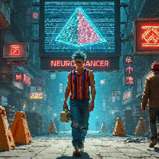
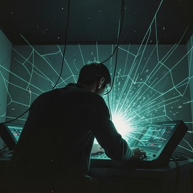
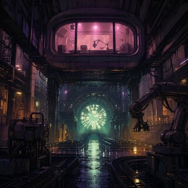

# The Flatline Sessions — Trilogy

Three point-and-click adventure games inspired by a famous cyberpunk trilogy,
built in Godot, each with an original lo-fi soundtrack.

| # | Cover | Game | Code | Play | Soundtrack |
|---|-------|------|------|------|------------|
| I |  | **The Flatline Sessions** (*Neuromancer*) | [neuromancer-godot](https://github.com/CryptoJones/neuromancer-godot) | [itch.io](https://cryptojones.itch.io/the-flatline-sessions) | [SoundCloud](https://soundcloud.com/as30p/sets/the-flatline-sessions) |
| II |  | **The Flatline Sessions II: Count Binary** | [TheFlatlineSessionsII](https://github.com/CryptoJones/TheFlatlineSessionsII) | [itch.io](https://cryptojones.itch.io/the-flatline-sessions-ii) | [SoundCloud](https://soundcloud.com/as30p/sets/the-flatline-sessions-ii-count) |
| III |  | **The Flatline Sessions III: Mona Lisa Underdrive** | [TheFlatlineSessionsIII](https://github.com/CryptoJones/TheFlatlineSessionsIII) | [itch.io](https://cryptojones.itch.io/the-flatline-sessions-iii) | [SoundCloud](https://soundcloud.com/as30p/sets/the-flatline-sessions-iii-mona) |

## Related

- [TFS-Visual-Novel-Tools](https://github.com/CryptoJones/TFS-Visual-Novel-Tools) — the
  book-agnostic, Apache-2.0 toolkit these games are built on: a data-driven Godot
  adventure engine (rooms, dialog, inventory, autosave) plus an art-book generator,
  for turning any book you own into an illustrated point-and-click adventure.
- [TheFlatlineSessions](https://github.com/CryptoJones/TheFlatlineSessions) — the
  pure-Python lo-fi ASCII-art "study with me" movie engine that gave the series
  its name (and its sound).

## Rights

The games cover only original code and art in their repositories — no rights to
the original novels or the 1988 *Neuromancer* game are granted or implied. See
each repo's LICENSE and NOTICE.

Proudly Made in Nebraska. Go Big Red! 🌽 https://xkcd.com/2347/
